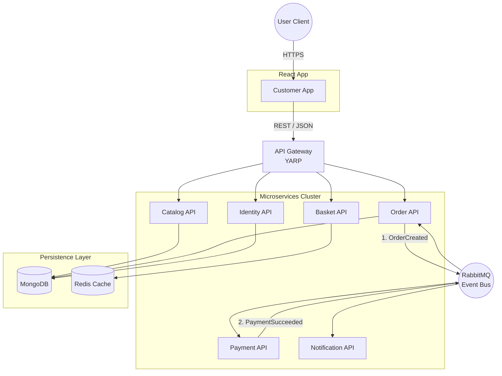

# E-Commerce Microservices

[](https://dotnet.microsoft.com/)
[](https://reactjs.org/)
[](https://www.mongodb.com/)
[](https://www.rabbitmq.com/)
[](https://www.docker.com/)
[](LICENSE)

> Plataforma de e-commerce moderna construída com arquitetura de microserviços, utilizando as mais recentes tecnologias .NET 10, React, MongoDB e RabbitMQ.

## Sobre o Projeto

Este projeto é uma implementação completa de uma plataforma de e-commerce utilizando:
- **Backend**: Microserviços em .NET 10 com Clean Architecture e DDD
- **Frontend**: React 18+ com TypeScript e Tailwind CSS
- **Mensageria**: RabbitMQ com MassTransit
- **Banco de Dados**: MongoDB para persistência
- **Cache**: Redis para otimização de performance
- **Gateway**: YARP (Yet Another Reverse Proxy)
- **Observabilidade**: Serilog + Seq
- **Containerização**: Docker e Docker Compose

## Diagrama de Arquitetura




## Começando

### Pré-requisitos

- [.NET 10 SDK](https://dotnet.microsoft.com/download/dotnet/10.0)
- [Docker Desktop](https://www.docker.com/products/docker-desktop)
- [Node.js 20+](https://nodejs.org/) (para frontend)
- [Git](https://git-scm.com/)

### Instalação

1. **Clone o repositório**
```bash
git clone https://github.com/seu-usuario/ecommerce-microservices.git
cd ecommerce-microservices
```

2. **Suba a infraestrutura com Docker**
```bash
docker-compose -f docker/docker-compose.yml up -d
```

3. **Verifique os serviços**
- MongoDB: http://localhost:27017
- Redis: localhost:6379
- RabbitMQ Management: http://localhost:15672 (guest/guest)
- Seq (Logs): http://localhost:5341

### Executando os Serviços

```bash
# Navegar até o serviço desejado
cd src/Services/Identity/Identity.API

# Restaurar dependências
dotnet restore

# Executar
dotnet run
```

## Tecnologias Utilizadas

### Backend
- **.NET 10** - Framework principal
- **MediatR** - CQRS e Mediator Pattern
- **FluentValidation** - Validações
- **AutoMapper** - Mapeamento de objetos
- **MassTransit** - Message Bus abstraction
- **MongoDB.Driver** - Driver oficial MongoDB
- **StackExchange.Redis** - Cliente Redis
- **Serilog** - Logging estruturado
- **xUnit** - Framework de testes

### Frontend
- **React 18** - Biblioteca UI
- **TypeScript** - Tipagem estática
- **TanStack Query** - Gerenciamento de estado servidor
- **Zustand** - Gerenciamento de estado global
- **React Router** - Roteamento
- **Tailwind CSS** - Framework CSS
- **Headless UI** - Componentes acessíveis

### DevOps
- **Docker** - Containerização
- **Docker Compose** - Orquestração local
- **GitHub Actions** - CI/CD
- **YARP** - Reverse Proxy

## Estrutura do Projeto

```
ecommerce-microservices/
├── src/
│   ├── Services/              # Microserviços
│   │   ├── Identity/
│   │   ├── Catalog/
│   │   ├── Basket/
│   │   ├── Order/
│   │   ├── Payment/
│   │   └── Notification/
│   ├── ApiGateway/            # YARP Gateway
│   ├── WebApps/               # Aplicações React
│   │   ├── customer-app/
│   │   └── admin-dashboard/
│   └── BuildingBlocks/        # Código compartilhado
├── tests/                     # Testes
├── docker/                    # Docker configs
├── docs/                      # Documentação
└── .github/                   # GitHub Actions
```

## Padrões e Princípios

- **Clean Architecture** - Separação de responsabilidades
- **Domain-Driven Design (DDD)** - Modelagem rica de domínio
- **CQRS** - Separação de comandos e queries
- **Event-Driven Architecture** - Comunicação via eventos
- **SOLID Principles** - Código manutenível
- **Repository Pattern** - Abstração de dados
- **Unit of Work** - Transações consistentes

## Roadmap

### Fase 1: Fundação  
- [x] Setup inicial do projeto
- [x] Infraestrutura Docker
- [x] Identity Service
- [x] Building Blocks compartilhados

### Fase 2: Core Services 
- [X] Catalog Service
- [X] Basket Service
- [X] Order Service

### Fase 3: Integrações 
- [X] Payment Service
- [X] Notification Service
- [X] Message Bus configurado
- [X] Stripe (WebHook)

### Fase 4: Gateway & Frontend 
- [X] API Gateway (YARP)
- [X] Customer App (React)
- [x] Admin Dashboard (React)

### Fase 5: Produção (Atual)
- [ ] CI/CD completo
- [ ] Testes E2E
- [ ] Observabilidade
- [ ] Deploy em Cloud

## Contribuindo

Contribuições são bem-vindas! Este é um projeto de estudo, mas feedbacks e sugestões são sempre apreciados.

1. Fork o projeto
2. Crie uma branch (`git checkout -b feature/AmazingFeature`)
3. Commit suas mudanças (`git commit -m 'feat: Add some AmazingFeature'`)
4. Push para a branch (`git push origin feature/AmazingFeature`)
5. Abra um Pull Request

## Commits Semânticos

Este projeto segue [Conventional Commits](https://www.conventionalcommits.org/):

- `feat`: Nova funcionalidade
- `fix`: Correção de bug
- `docs`: Documentação
- `style`: Formatação
- `refactor`: Refatoração
- `test`: Testes
- `chore`: Tarefas de build/config

## Licença

Este projeto está sob a licença MIT. Veja o arquivo [LICENSE](LICENSE) para mais detalhes.

## Autor

**Marcos Vítor**
- GitHub: [@marcosv1tor](https://github.com/marcosv1tor)
- LinkedIn: [Marcos Vítor](https://www.linkedin.com/in/marcosvitor7/)

## Agradecimentos

- Microsoft - eShopOnContainers como referência
- Jason Taylor - Clean Architecture template
- Comunidade .NET Brasil

---------
## Nota:
-  PROJETO DESENVOLVIDO SEM AGENTES IA PARA CONSOLIDAR CONHECIMENTOS 

Se gostou do projeto, considere dar uma estrela!

**Status do Projeto**: Em Desenvolvimento Ativo
